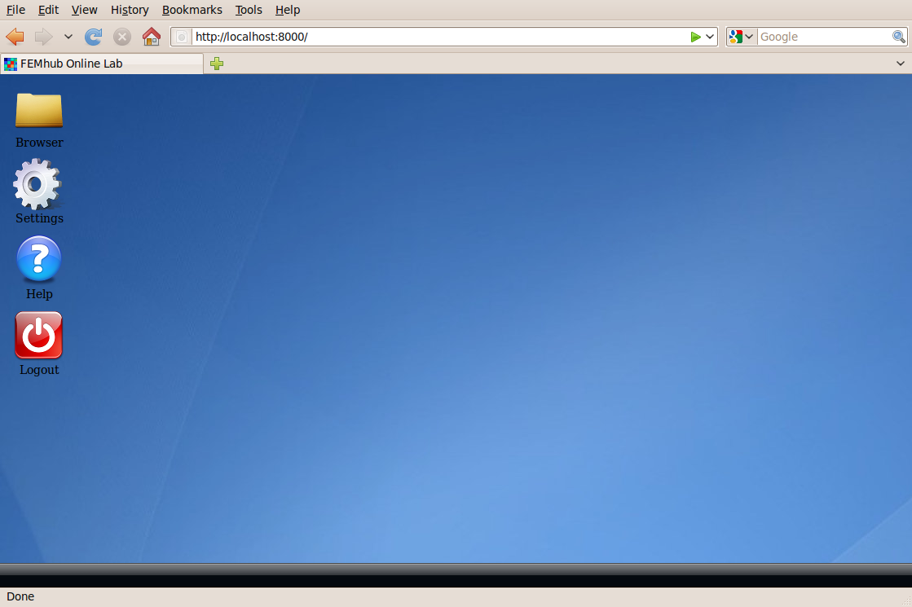

How to Use FEMhub Online Lab
============================
FEMhub online lab can be used on your local machine, after you install the
FEMhub package. Alternatively, if you do not want to download and install
anything you can use FEMhub online lab hosted in the `server of hp-FEM group at
University of Nevada, Reno <http://lab.femhub.org/>`_ (UNR).

FEMhub Online Lab in the Server at UNR
---------------------------------------------------------------
If you want to use FEMhub online lab hosted at the server of hp-FEM group, University of Nevada Reno,
please follow the follwing instructions:

Step 1: To sign up for a new account go to the `Online Lab
<http://lab.femhub.org/>`_ main page, and click **"Create account"** button at the
bottom of the login window.
This is automatic and fast. Report any problems to **femhub@googlegroups.com**.

Step 2: Log into the `online lab <http://lab.femhub.org/>`_. Click the
**"Browser"** icon. After the browser opens, click **"Fork Worksheet"** and
then after selecting any published worksheet just click **Fork** button.

Step 3: Once the selected worksheet is forked, it will appear on the right part
of the online lab "Browser". Click it and scroll down the first input box, and click
**"Evaluate"** at the bottom of each input box. Then the output will appear below
the input box.

Step 4: There are multiple other worksheets to begin with. Try them out and give us your feedback!

Step 5: You can try out worksheets related to Hermes, FiPy, PHAML etc. that allow you
to solve finite element problems via the internet. Feel free to adjust the
existing worksheets to fit your own needs. We are working on expanding the
possibilities.

To write your own code in Python and evaluate, click the **"New Worksheet"**
button in the online lab "Browser".

FEMhub Online Lab on Your Local Machine
---------------------------------------

First download and Install FEMhub following the instructions elsewhere on the documentation.
Then go to the femhub top directory, and just execute **./femhub** from the command line,
and after that type **lab()**.
::
    $ ./femhub
    ----------------------------------------------------------------
    | Femhub Version 0.9.10, Release Date: November 21, 2010       |
    | Type lab() for the GUI.                                      |
    ----------------------------------------------------------------
    In [1]: lab()

Then open your web browser at http://localhost:8000/

After you create an account and log in you will see a desktop like interface
with a few icons. Click **"Browser"** icon and then click **"New Worksheet"**
to open a new worksheet. In the text input window of the worksheet copy-paste the following:
::
    # Import libraries.
    from sympy import Symbol, lambdify, cos, sin, exp, log
    from numpy import abs

    # Define symbolic variable.
    x = Symbol("x")

    # The Newton's method.
    def newton(f, dfdx, x, x0, eps = 1e-8):
	f = lambdify(x, f, modules=["math"])
	dfdx = lambdify(x, dfdx, modules=["math"])

	x_k = x0

	counter = 0
	while True:
	    counter += 1
	    x_k_plus_one = x_k - f(x_k) / dfdx(x_k)
	    print "Next approximation:", x_k_plus_one
	    # Stopping criterion 1:
	    if abs(x_k_plus_one - x_k) < eps: break
	    # Stopping criterion 2:
	    #if abs(f(x_k_plus_one)) < eps: break
	    x_k = x_k_plus_one
	print "Steps taken:", counter

    # Example 1 (standard behavior). Enter function f(x), its derivative f'(x), symbol x, initial guess x_0, and tolerance epsilon:
    newton(cos(x) - x, -sin(x) - 1, x, 1, 1e-8)

    # Example 2 (standard behavior):
    newton(1/(1+x**2) - x, -1 / (1+x**2) / (1+x**2) * 2*x - 1, x, 5, 1e-8)

    # Example 3 (linear problems):
    newton(x - 2, 1, x, 4, 1e-8)

    # Example 4 (failure if initial guess is far from true solution):
    newton(log(x), 1/x, x, 10, 1e-8)

    # Example 5 (problems with flat functions)
    newton(x**8., 8.*x**7., x, 1, 1e-8)

Click "Evaluate" button and you will see the output below the input box.

.. image:: img/femhub_lab/worksheet.png
   :align: center
   :width: 800
   :height: 600
   :alt: Screenshot of FEMhub Online Lab
