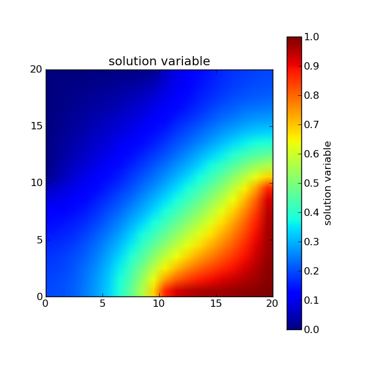
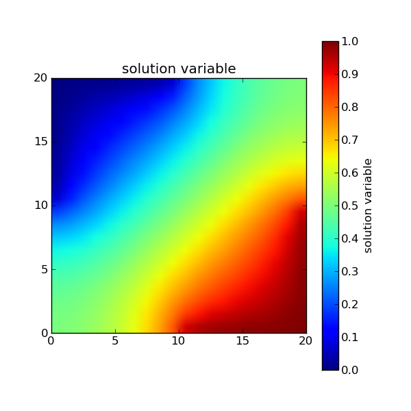
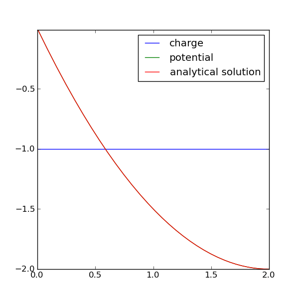
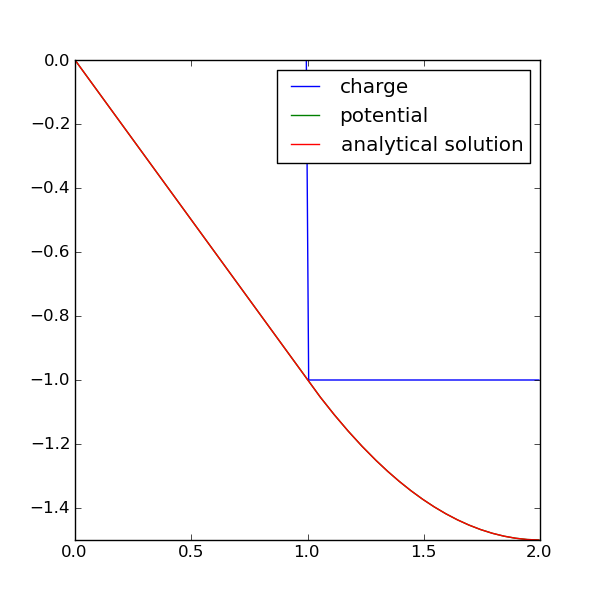
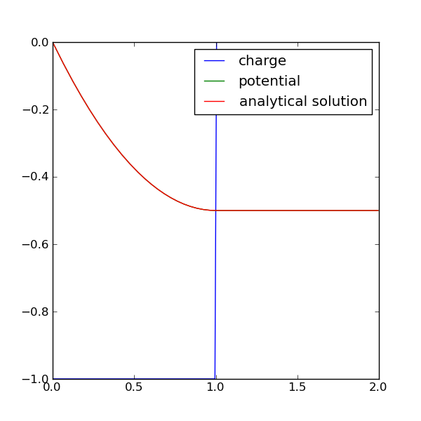

=====================
FEMhub Examples: FiPy
=====================

What is FiPy
------------

FiPy is an object oriented, partial differential equation (PDE) solver, written in Python, based on a standard finite volume (FV) approach. The framework has been developed in the Metallurgy Division and Center for Theoretical and Computational Materials Science (CTCMS), in the Materials Science and Engineering Laboratory (MSEL) at the National Institute of Standards and Technology (NIST).

The source of this example is the FiPy official `site <http://www.ctcms.nist.gov/fipy/>`_, where you can view the details.

Let us take one of the FiPy examples here to learn how we can use it in the FEMhub lab.

Example mesh20x20
-----------------------

This example solves a diffusion problem and demonstrates the use of
applying boundary condition patches.
::
        from fipy import *
  
	nx = 20
	ny = nx
	dx = 1.
	dy = dx
	L = dx * nx
	mesh = Grid2D(dx=dx, dy=dy, nx=nx, ny=ny)
	
Now we create a :class:`~fipy.variables.cellVariable.CellVariable` and initialize it to zero:
::
	phi = CellVariable(name = "solution variable",
			   mesh = mesh,
			   value = 0.)
	
and then create a diffusion equation.  This is solved by default with an
iterative conjugate gradient solver.
::
	D = 1.
	eq = TransientTerm() == DiffusionTerm(coeff=D)
 
We apply Dirichlet boundary conditions
::
	valueTopLeft = 0
	valueBottomRight = 1

to the top-left and bottom-right corners.  Neumann boundary conditions
are automatically applied to the top-right and bottom-left corners.
::
	x, y = mesh.getFaceCenters()
	facesTopLeft = ((mesh.getFacesLeft() & (y > L / 2))
			| (mesh.getFacesTop() & (x < L / 2)))
	facesBottomRight = ((mesh.getFacesRight() & (y < L / 2))
			    | (mesh.getFacesBottom() & (x > L / 2)))
	
	BCs = (FixedValue(faces=facesTopLeft, value=valueTopLeft),
	       FixedValue(faces=facesBottomRight, value=valueBottomRight))

We create a viewer to see the results
::

	viewer = Viewer(vars=phi, datamin=0., datamax=1.)
	viewer.plot(filename="a.png")

and solve the equation by repeatedly looping in time:
::
	timeStepDuration = 10 * 0.9 * dx**2 / (2 * D)
	steps = 10
	for step in range(steps):
	    eq.solve(var=phi,
		     boundaryConditions=BCs,
		     dt=timeStepDuration)
	    viewer.plot(filename="b%02d.png" %step)

We can test the value of the bottom-right corner cell.
::
	print numerix.allclose(phi(((L,), (0,))), valueBottomRight, atol = 1e-2)
	# Expected:
	## 1

We can also solve the steady-state problem directly
::
	DiffusionTerm().solve(var=phi, 
			      boundaryConditions = BCs)
	viewer.plot(filename="c.png")

and test the value of the bottom-right corner cell.
::
	print numerix.allclose(phi(((L,), (0,))), valueBottomRight, atol = 1e-2)
        # Expected:
        ## 1

To view the example in the FEMhub online lab `click here <http://lab.femhub.org/home/pub/23/>`_.

Example Diffusion - Electrostatics
----------------------------------

The Poisson equation is a particular example of the steady-state diffusion
equation. We examine a few cases in one dimension.
::
	from fipy import *

	nx = 200
	dx = 0.01
	L = nx * dx
	mesh = Grid1D(dx = dx, nx = nx)

Given the electrostatic potential :math:`\phi`,
::

	potential = CellVariable(mesh=mesh, name='potential', value=0.)

the permittivity :math:`\epsilon`,
::
	permittivity = 1

the concentration :math:`C_j` of the :math:`j^\text{th}` component with valence
:math:`z_j` (we consider only a single component :math:`C_\text{e}^{-}` with
valence with :math:`z_{\text{e}^{-}} = -1`)
::
	electrons = CellVariable(mesh=mesh, name='e-')
	electrons.valence = -1

and the charge density :math:`\rho`,
::
	charge = electrons * electrons.valence
	charge.name = "charge"

The dimensionless Poisson equation is

.. math::
	\nabla\cdot\left(\epsilon\nabla\phi\right) = -\rho = -\sum_{j=1}^n z_j C_j
So,
::
	potential.equation = (DiffusionTerm(coeff = permittivity) 
			      + charge == 0)

Because this equation admits an infinite number of potential profiles,
we must constrain the solution by fixing the potential at one point:
::
	bcs = (FixedValue(faces=mesh.getFacesLeft(), value=0),)

First, we obtain a uniform charge distribution by setting a uniform concentration
of electrons :math:`C_{\text{e}^{-}} = 1`.
::
	electrons.setValue(1.)

and we solve for the electrostatic potential
::
	potential.equation.solve(var=potential, 
				 boundaryConditions=bcs)

This problem has the analytical solution

.. math::

    \psi(x) = \frac{x^2}{2} - 2x
So,
::
	x = mesh.getCellCenters()[0]
	analytical = CellVariable(mesh=mesh, name="analytical solution", 
				  value=(x**2)/2 - 2*x)

which has been satisifactorily obtained
::
	print potential.allclose(analytical, rtol = 2e-5, atol = 2e-5)
	# Expected:
	## 1

If we are running the example interactively, we view the result
::
	viewer = Viewer(vars=(charge, potential, analytical))

	viewer.plot(filename="a.png")

Next, we segregate all of the electrons to right side of the domain

.. math::

    C_{\text{e}^{-}} =
    \begin{cases}
        0& \text{for $x \le L/2$,} \\
        1& \text{for $x > L/2$.}
    \end{cases}
So,
::
	x = mesh.getCellCenters()[0]
	electrons.setValue(0.)
	electrons.setValue(1., where=x > L / 2.)

and again solve for the electrostatic potential
::
	potential.equation.solve(var=potential, 
				 boundaryConditions=bcs)

which now has the analytical solution

.. math::

    \psi(x) =
    \begin{cases}
        -x& \text{for $x \le L/2$,} \\
        \frac{(x-1)^2}{2} - x& \text{for $x > L/2$.}
    \end{cases}
So,
::
	analytical.setValue(-x)
	analytical.setValue(((x-1)**2)/2 - x, where=x > L/2)

	print potential.allclose(analytical, rtol = 2e-5, atol = 2e-5)
	# Expected:
	## 1

and again view the result
::
	viewer.plot(filename="b.png")

Finally, we segregate all of the electrons to the left side of the
domain

.. math::

    C_{\text{e}^{-}} =
    \begin{cases}
        1& \text{for $x \le L/2$,} \\
        0& \text{for $x > L/2$.}
    \end{cases}
So,
::
	electrons.setValue(1.)
	electrons.setValue(0., where=x > L / 2.)

and again solve for the electrostatic potential
::
	potential.equation.solve(var=potential, 
				 boundaryConditions=bcs)

 which has the analytical solution

.. math::

    \psi(x) =
    \begin{cases}
        \frac{x^2}{2} - x& \text{for $x \le L/2$,} \\
        -\frac{1}{2}& \text{for $x > L/2$.}
    \end{cases}

We again verify that the correct equilibrium is attained
::
	analytical.setValue((x**2)/2 - x)
	analytical.setValue(-0.5, where=x > L / 2)

	print potential.allclose(analytical, rtol = 2e-5, atol = 2e-5)
	# Expected:
	## 1

and once again view the result
::
	viewer.plot(filename="c.png")

