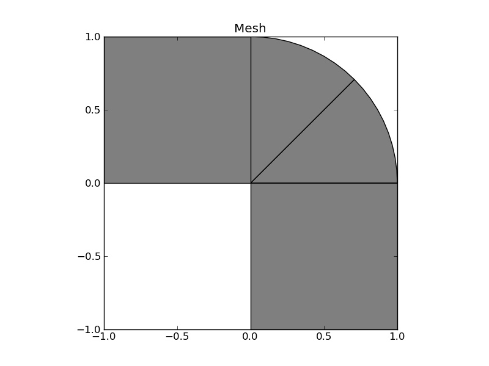
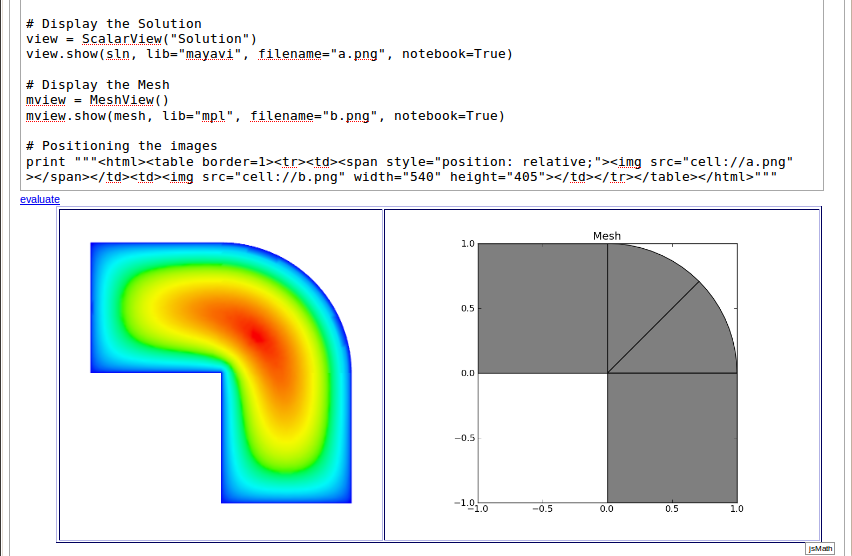

=========================
FEMhub: Tutorial Examples 
=========================

This tutorial should give you a good idea of how to use different FEM codes in FEMhub.
The document is under continuous development - if you find bugs or would like us to 
improve something, let us know through the `mailing list <http://groups.google.com/group/femhub/>`_.

Hermes2D Examples
-----------------

What is Hermes2D
~~~~~~~~~~~~~~~~
`Hermes2D <http://hpfem.org/hermes2d>`_ is a C++ library for rapid prototyping
of space and space-time adaptive hp-FEM solvers, and it is one of the FEM engines
included in FEMhub. Although Hermes2D is written in C++ you do not need to know anything about C++ besides
basic python when you use Hermes2D within FEMhub. For details on how to use Hermes2D itself please refer to `Hermes2D documentation <http://hpfem.org/hermes2d/doc/index.html>`_.

Finite Element Mesh
~~~~~~~~~~~~~~~~~~~

Every finite element computation starts with partitioning the domain
into a finite element mesh. Hermes uses triangles and quadrilaterals, and 
can combine both element types in one mesh. While complicated meshes need 
to be constructed using specialized mesh generation software, in many cases 
we only need a simple initial mesh that can be created by hand. In Hermes, all you 
need to do is partition the domain very coarsely into several large elements,
and the adaptivity will take care of the rest. 

The domain is defined via four macroelements -- two
quadrilaterals and two curvilinear triangles. The elements are enumerated from 0 to 3. 
One also needs to enumerate all mesh vertices and assign markers to all boundary edges. 
Boundary markers are used to link boundary conditions with the boundary edges.
The following example Mesh will make clear about how to create mesh in FEMhub.

Example: Mesh
~~~~~~~~~~~~~

First import the required modules::

    # Import modules
    from hemres2d import Mesh, MeshView

Then you can use Mesh.create() method to create a mesh. It takes four lists
(vertices, elements, boundaries, and curves) as arguments.
::

    # Creates a mesh from a list of vertices, elements, boundaries and curves.
    mesh = Mesh()
    mesh.create([
            [0, -1],
            [1, -1],
            [-1, 0],
            [0, 0],
            [1, 0],
            [-1, 1],
            [0, 1],
            [0.707106781, 0.707106781]
        ], [
            [0, 1, 4, 3, 0],
            [3, 4, 7, 0],   
            [3, 7, 6, 0],
            [2, 3, 6, 5, 0]
        ], [
            [0, 1, 1],
            [1, 4, 2],
            [3, 0, 4],
            [4, 7, 2],
            [7, 6, 2],
            [2, 3, 4],
            [6, 5, 2],
            [5, 2, 3]
        ], [
            [4, 7, 45],
            [7, 6, 45]
        ])

The list of ``vertices`` defines the coordinates of all mesh vertices (in any order). 
The list of ``elements`` contains all elements in the mesh via zero-based indices of their vertices in counter-clockwise order, plus an extra number denoting the element (material) marker. Element markers allow you to use different material parameters in areas with different material parameters. Moreover, Hermes allows you to assign different weak formulations to those areas, which can be very useful for some types of multiphysics problems. If the domain is composed of only one material, as in our case, all elements may be assigned a zero marker:

The last mandatory list, ``boundaries``, defines boundary markers for all
boundary edges. By default, all edges have zero markers. Only those with
positive markers are considered to be part of the domain boundary and can be
assigned a boundary condition, as we will see later. An edge is identified by
two vertex indices.

Finally, the the list of ``curves``, contains all curved edges.  Each curved edge is 
described by one NURBS curve, defined by its degree, control points and knot vector. 
Simplified syntax is available for circular arcs.

The following portion of code illustrates various types of initial mesh refinements.
It does not matter if the mesh becomes irregular, in fact, arbitrarily irregular
meshes are at the heart of Hermes:
::

      # perform some sample initial refinements
      mesh.refine_all_elements()          # refines all elements
      mesh.refine_towards_vertex(3, 4)    # refines mesh towards vertex #3 (4x)
      mesh.refine_towards_boundary(2, 4)  # refines all elements along boundary 2 (4x)
      #mesh.refine_element(86, 0);        # Refines element #86 isotropically.
      #mesh.refine_element(112, 0);       # Refines element #112 isotropically.
      #mesh.refine_element(84, 2);        # Refines element #84 anisotropically.
      #mesh.refine_element(114, 1);       # Refines element #114 anisotropically.

You can also convert triangles to quads and vice versa
::
  mesh.convert_triangles_to_quads()
  mesh.convert_quads_to_triangles()

The following code illustrates how to visualize the mesh using the class MeshView:
::

    # Display the Mesh
    mesh.plot(filename="a.png")

and you will see the following output

    .. image:: img/meshlab.png
       :align: center
       :width: 400
       :height: 400
       :alt: Image of the mesh created via the MeshView class.

To view this example published on FEMhub online lab click `here <http://nb.femhub.org/pub/62>`_.

Example: Poisson Equation
~~~~~~~~~~~~~~~~~~~~~~~~

Let us solve the Poisson equation

.. math::
    :label: poisson1

       -\Delta u = CONST_F

on the L-shaped domain $\Omega$ from the previous example,
equipped with a homogeneous (zero) Dirichlet boundary condition

.. math::
    :label: poisson2

       u = 0\ \ \  \mbox{on}\  \partial \Omega,

where $CONST_F$ is a real number. The weak formulation 
is derived in the standard way, first by multiplying equation :eq:`poisson1` with a test
function $v$, then integrating over the domain $\Omega$, and then applying the Green's
theorem (integration by parts) to the second derivatives.
Because of the homogeneous Dirichlet condition :eq:`poisson2`,
the proper space for the solution is $V = H^1_0(\Omega)$. The weak formulation reads:
Find $u \in V$ such that

.. math::
    :label: poissonweak

         \int_\Omega \nabla u \cdot \nabla v \;\mbox{d\bfx} = CONST_F \int_\Omega v \;\mbox{d\bfx} \ \ \ \mbox{for all}\ v \in V.

To run this example let us first import the required modules::

    # Import modules
    from hermes2d import Mesh, MeshView, H1Shapeset, PrecalcShapeset, H1Space, \
        WeakForm, Solution, ScalarView, LinSystem, DummySolver
    from hermes2d.forms import set_forms
    from hermes2d.examples.c03 import set_bc

Then you can use Mesh.create() method to create a mesh. It takes four lists
(vertices, elements, boundaries, and curves) as arguments.::

    # Creates a mesh from a list of vertices, elements, boundaries and curves.
    mesh = Mesh()
    mesh.create([
            [0, -1],
            [1, -1],
            [-1, 0],
            [0, 0],
            [1, 0],
            [-1, 1],
            [0, 1],
            [0.707106781, 0.707106781]
        ], [
            [0, 1, 4, 3, 0],
            [3, 4, 7, 0],   
            [3, 7, 6, 0],
            [2, 3, 6, 5, 0]
        ], [
            [0, 1, 1],
            [1, 4, 2],
            [3, 0, 4],
            [4, 7, 2],
            [7, 6, 2],
            [2, 3, 4],
            [6, 5, 2],
            [5, 2, 3]
        ], [
            [4, 7, 45],
            [7, 6, 45]
        ])

You can try various types of initial mesh refinements.
::

      # perform some sample initial refinements
      mesh.refine_all_elements()          # refines all elements
      mesh.refine_towards_vertex(3, 4)    # refines mesh towards vertex #3 (4x)
      mesh.refine_towards_boundary(2, 4)  # refines all elements along boundary 2 (4x)

We can now state our problem in the following way:

::

    # Initialize the weak formulation
    wf = WeakForm(1) 
    set_forms(wf) 

The class WeakForm represents the weak formulation of the PDE and must be
initialized with the number of equations in the system, in our case one.

Given the weak formulation and the discretization determined by the space and its mesh,
we can proceed to the approximate solution of the problem by the Galerkin method.
This method is the core of Hermes and provides a way to obtain a sparse linear
system of equations, represented by the class LinSystem in the code. The solution
of the linear system then yields an approximate solution of the original problem.

The class LinSystem needs three things: your weak formulation, your spaces and
finally an external sparse matrix solver, for example CG or UMFPACK. The following lines
create the linear solver, initialize the LinSystem class and pass a pointer to
the H1Space we have created in the previous section.
::

    # initialize the linear system and solver
    solver = DummySolver()
    sys = LinSystem(wf, solver)
    sys.set_spaces(space)
    sys.set_pss(pss) 

The last line must be included for historical reasons. During matrix assembly,
Hermes caches the values of all shape function polynomials for better performance.
The cache is represented by the class PrecalcShapeset and you have to
include the following lines at the beginning of your program:
::

    shapeset = H1Shapeset()
    pss = PrecalcShapeset(shapeset) 

Finally, we tell LinSystem to assemble the stiffness matrix and the right-hand
side and solve the resulting linear system: 
::

    # Assemble the stiffness matrix and solve the system
    sys.assemble()
    A = sys.get_matrix()
    b = sys.get_rhs()
    from scipy.sparse.linalg import cg
    x, res = cg(A, b)
    sln = Solution()
    sln.set_fe_solution(space, pss, x) 

For the Poisson problem, we are finished. The last two lines can be repeated many 
times in time-dependent problems. The instance of the class Solution, upon the
completion of LinSystem::solve(), contains the approximate solution of
the PDE. You can ask for its values or you can visualize the solution immediately 
using the ScalarView class:
::

    # Visualize the solution
    view = ScalarView("Solution")
    view.show(sln, lib="mayavi", filename="a.png", notebook=True)

You can visualize the mesh using the MeshView class:
::
    # Display the Mesh
    mesh.plot(filename="b.png")
 
Furthermore, you can position the images by using the following html codes:
::
    # Positioning the images
    print """<html><table border=1><tr><td></td><td></td></tr></table></html>"""

The following figure shows the output.

To view this example published on FEMhub online lab click `here <http://nb.femhub.org/pub/56>`_.
