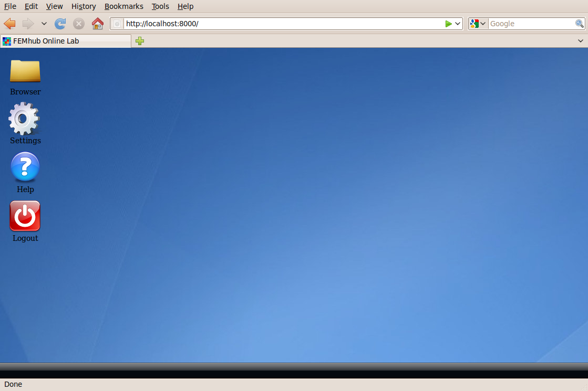

Download, Install and Run FEMhub
================================
You can run download and install FEMhub easily on your local desktop.
Please follow the instructions below. If you do not want to download or
install anything you can use our `FEMhub Online Numerical Methods Laboratory <http://lab.femhub.org/>`_.

Instructions for Regular Users: Binary
--------------------------------------
Regular users or nondevelopers are encouraged to download the latest binary
release for their platform. Developers should follow the instructions on
building from sources below.

You can view a list of the binaries of all versions `here <http://femhub.org/pub/>`_. From there you can download the
version you want.

If you downloaded a binary, you do not need to do anything, just extract it and
you are ready to go. For example, in ubuntu machine you would do the following:
::
    \$ wget http://femhub.org/pub/femhub-0.9.10.beta2-ubuntu64.tar.gz
    \$ tar xzf femhub-0.9.10.beta2-ubuntu64.tar.gz

Then follow the instructions on running FEMhub below.

Instructions for Developers: Building from Sources
--------------------------------------------------
You can build from sources in two ways:

**(1) Build using the sources of the latest release:** If you want to build the latest
(stable) release from source, use the femhub-*.tar file (not tar.gz, those are
binaries), as explained below for each platform. You can get the tarball of sources
`here <http://femhub.org/pub/>`_. The most recent stable version is femhub-0.9.9 but you can try our latest beta version which contains the new version of the online lab.

**(2) Build using the git repository:** If you use git, then instead of downloading the tarball of
sources and building it, you can use the latest development version (which might contain bugs) available in our git
repository.

Building in Linux Distributions
~~~~~~~~~~~~~~~~~~~~~~~~~~~~~~~
**Build using the sources of the latest release** (change the version 0.9.9 below to the version of the latest
release, which you can find `here <http://femhub.org/pub/>`_):

To download the sources you can use the following command in Ubuntu Linux:
::

  \$ wget http://femhub.org/pub/femhub-0.9.10.beta1.tar

After you download the sources, please read below on how to build FEMhub and work around common issues:

1. Make sure you have the dependencies and 2GB free disk space.
Install these using your package manager
::
  gcc, g++, make, gfortran, m4, perl, and tar.

For example in Ubuntu Linux you can do
::
  \$ sudo apt-get install gcc g++ gfortran make m4 perl tar

2. Extract the tarball:
::

  \$ tar xf femhub-0.9.10.beta1.tar

3. cd into the  femhub directory and type make:
::
      \$ cd femhub-0.9.10.beta1
      \$ make

Note: for installing mesa (and vtk too), you need the X11 header files
currently, so you also need to do::

    \$ sudo apt-get install libx11-dev x11proto-xext-dev libxext-dev libxt-dev

**Build using the git repository:**

First make sure that you have git installed in your machine, and then issue the
following commands to build FEMhub:
::
    \$ git clone http://git.hpfem.org/git/femhub.git
    \$ cd femhub
    \$ ./femhub -d
    \$ make

Building in Mac OS X
~~~~~~~~~~~~~~~~~~~~
**Build using the sources of the latest release** (change the version 0.9.9 below to the version of the latest
release, which you can find `here <http://femhub.org/pub/>`_):

You can use the following command to download the tarball of sources:
::
  \$ curl -O http://femhub.org/pub/femhub-0.9.9.tar

1. Make sure you have the dependencies and 2GB free disk space.

Google "download Xcode". You have to register as Apple Developer (yes, you gotta believe). Do not pay any fees, they may offer you access to their newest updates for $99 per year or more. Xcode contains make and other things that are required to build FEMhub. Then download, unpack, and build FEMhub:

WARNING: If "gcc -v" outputs 4.0.0, you  *must* upgrade XCode (free from Apple), since that version of GCC is very broken.

2. Extract the tarball:
::

  \$ tar xf femhub-0.9.9-*.tar

3. cd into the femhub directory and type make:
::
  \$ cd femhub-0.9.9
  \$ make

**Build using the git repository:**

First make sure that you have git installed in your machine, and then issue the
following commands to build FEMhub:
::
    \$ git clone http://git.hpfem.org/git/femhub.git
    \$ cd femhub
    \$ ./femhub -d
    \$ make

Building in Microsoft Windows
~~~~~~~~~~~~~~~~~~~~~~~~~~~~~
**Build using the sources of the latest release** (change the version 0.9.9 below to the version of the latest
release, which you can find `here <http://femhub.org/pub/>`_):

Make sure you have the dependencies and 2GB free disk space.

Download and install the Linux emulator Cygwin from `here <http://www.cygwin.com/>`_ (the small icon in the top-right corner). While running setup.exe, you need to install
::
  cmake, gcc4, gfortran, git, gitk, libX11-devel, libXext-devel,
  libXt-devel, libXt, libXext, make, m4, openssl-devel, perl,
  python, wget, xextproto.

This is a bit tedious but you have to survive it. We would like to create one package containing all of those, to facilitate the download - any help is welcome. For some packages, there will be more choices - follow the magical word GNU. Then download, unpack, and build FEMhub as in Linux:
::
  \$ wget http://femhub.org/pub/femhub-0.9.9.tar
  \$ tar -xf femhub-0.9.9.tar
  \$ cd femhub-0.9.9
  \$ make

**Build using the git repository:**

First make sure that you have git installed in your machine, and then issue the
following commands to build FEMhub:
::
    \$ git clone http://git.hpfem.org/git/femhub.git
    \$ cd femhub
    \$ ./femhub -d
    \$ make

Building in Other Operating Systems
~~~~~~~~~~~~~~~~~~~~~~~~~~~~~~~~~~~
You may try building in other operating systems and please let us know how it goes.
NOTE: On some operating systems it might be necessary to install
gas/as, gld/ld, gnm/nm, but on most these are automatically
installed when you install the programs listed above.  Only OS X
>= 10.4.x and certain Linux distributions are 100% supported.

After Building Starts
~~~~~~~~~~~~~~~~~~~~~

After the building process starts, wait between 37 minutes to 1.5 hour depending upon the speed of your computer. Everything is automatic and non-interactive.

If you encounter problems, let us know through the FEMhub mailing list: http://groups.google.com/group/femhub

If you want, you can also download a binary from `here <http://femhub.org/pub/>`_, however, if it doesn't work for you, compile from source, that should always work.

Running FEMhub
--------------

Go the femhub top directory, and just execute
::

 ./femhub

from the command line, and type lab() after that.
::
    \$ ./femhub
    ----------------------------------------------------------------------
    | Femhub Version 0.9.9, Release Date: 2010-05-05                     |
    | Type lab() for the GUI.                                            |
    ----------------------------------------------------------------------
    In [1]: lab()

Then point your browser to http://localhost:8000/

For more information about using the online lab `click here
<femhub_lab.html>`_.
