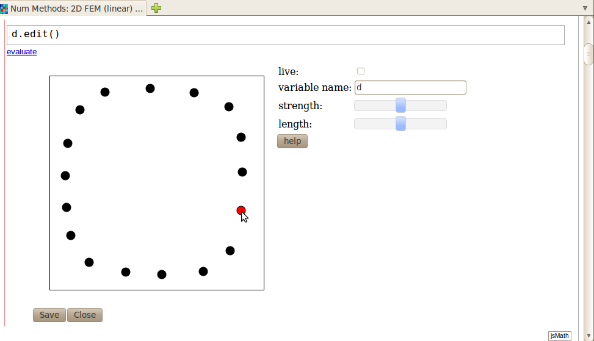
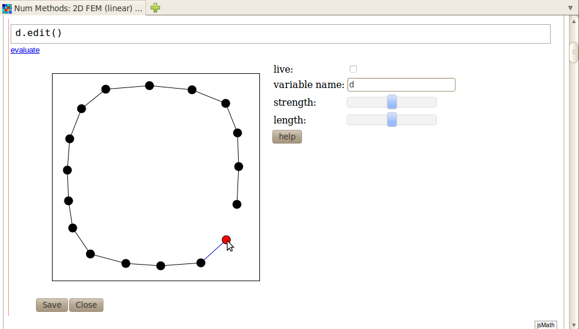
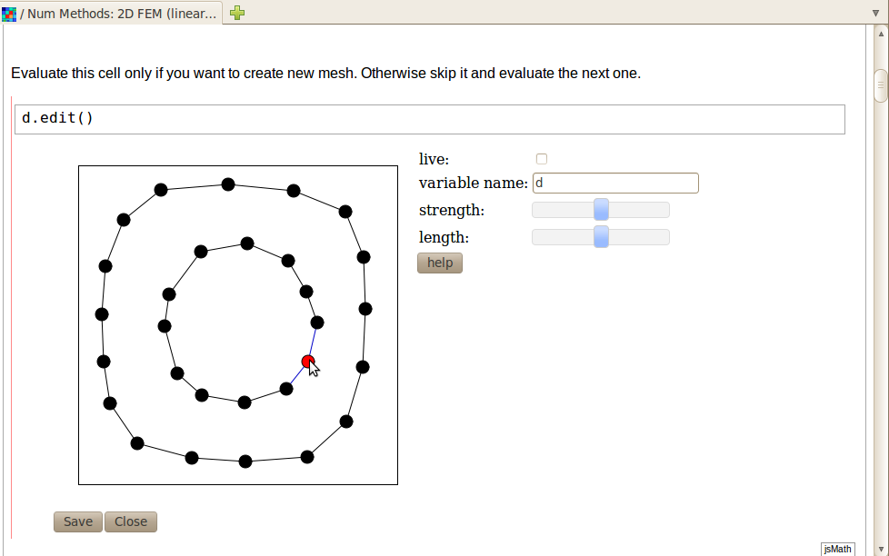
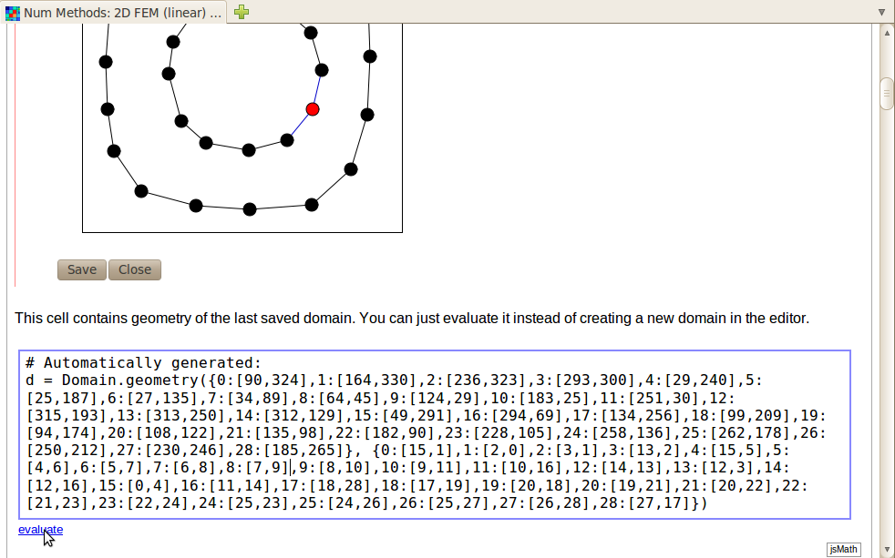
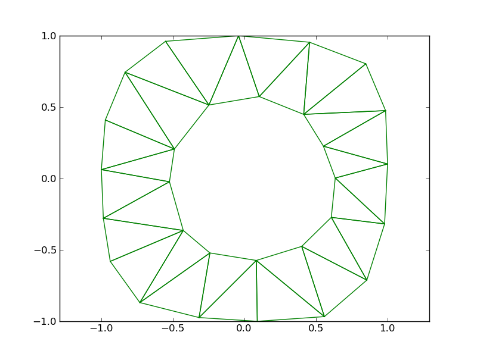
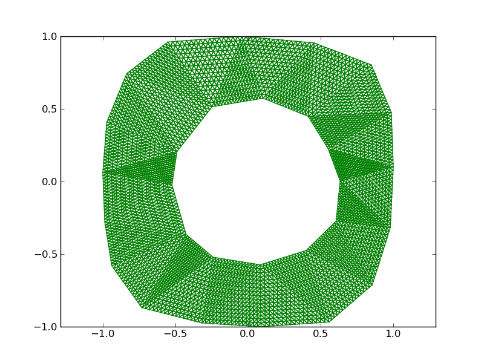
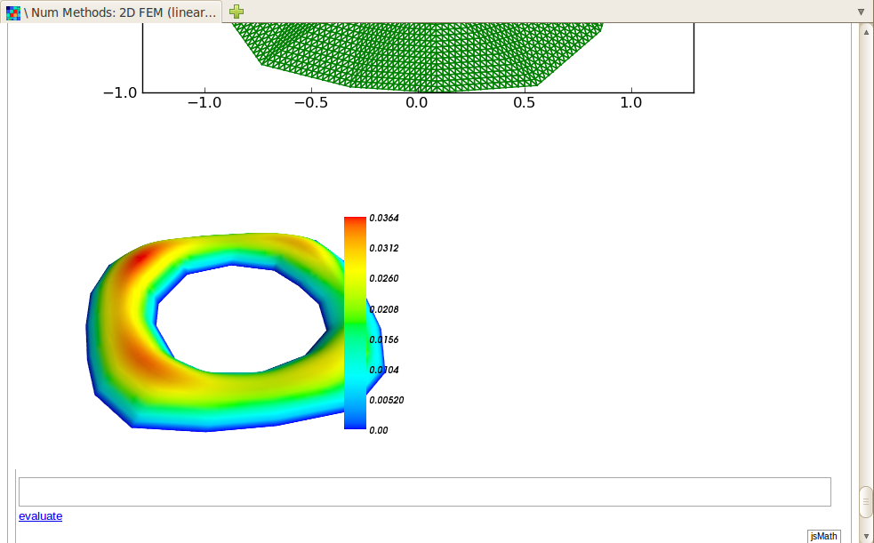

==============================
Mesh Generation in Web Browser
==============================

This is a documentation for online Finite Element Mesh Editor for `FEMhub <http://femhub.org>`_.
It is an ongoing project of hp-FEM group at University of Nevada, Reno. This work is available under the GPL license (Version 2, 1991).

**Note:** Following instructions are for the **old version** of the Online Lab. To read the
instructions for the new version of the Online Lab please `click here
<http://hpfem.org/mesheditor-flex/doc>`_.

Domain Editor Based on JavaScript
----------------------------------
This mesh editor is currently under further development and will be available with full features soon. Currently you can employ some features to create domains.

Using the Editor in the Online Lab
~~~~~~~~~~~~~~~~~~~~~~~~~~~~~~~~~~

To use the editor in the Online Lab, first import the "Domain" module:
::
  from femhub import Domain
  d = Domain()

Then type the following code so that the editor appears:
::
  d.edit()

.. image:: imgmesh/jsmeshed1.png
   :align: center
   :width: 988 
   :height: 742
   :alt: Screenshot of FEMhub Online Lab

Creating Vertex
~~~~~~~~~~~~~~~
Click on the empty box and black dots will appear. These are markers for vertices and you can drag them. When you click on the box be careful not to click too close to existing vertices.

You can select a vertex, and it will glow red when you click it.

Creating Edge
~~~~~~~~~~~~~
Select the first vertex. Click on another vertex (different than the selected one) to turn on/off (toggle) the edge between them. 
Double click on vertex or drag to the edge for the frame (be careful, there is no UNDO yet!). Hold 'SHIFT' to perserve the selected vertex after creating or erasing an edge.

Now once you click save, the next cell will contain geometry of the last saved domain. You can just evaluate it instead of creating a new domain in the editor.

Once you have a set of vertices, you can use triangulate() method to create the mesh. Please see the following usage:
::
  # Rescale into the square (-1, 1)^2
  x_min = -1.0
  y_min = -1.0
  width = 2.0
  height = 2.0
  d.fit_into_rectangle(x_min, y_min, width, height)

  # Create triangular mesh
  mesh = d.triangulate()
  mesh.show(filename = "a.png")
  print "Nodes:", len(mesh.nodes)
  print "Elements:", len(mesh.elems)
  print "Boundary edges:", len(mesh.bdy)

If you evaluate the above code you will get the following output:

Now you can use the functionalities in the packages included in FEMhub to manipulate it in various ways. For example you can use refine_all_elements() method of hermes2d to refine the mesh and get the following output:

Then using the functionalities of Mayavi, you can plot your solution.
::
  # Plotting (based on Mayavi)
  print "Plotting..."
  from femhub import plotsln
  plotsln(mesh, z = z, sln = vertex_values, colorbar=True, view = (260, 50), filename = "z.png")
  print "Plotting completed."
  print "Solution:"
  print " "

MeshEditor Based on Flex
------------------------
The source code can be viewed in the `git repository <http://github.com/aayush/mesheditor.git>`_.
The latest development is in branch zoom.

Build Instructions
~~~~~~~~~~~~~~~~~~
Flex sdk can be downloaded from http://www.adobe.com/cfusion/entitlement/index.cfm?e=flex3sdk

To compile the MeshEditor place flex_sdk/bin to your system path and do
::
    \$ make

To test it open the MeshEditor.swf with your browser. You will need flash player 10 or above.
You can also use the MeshEditor on the FEMhub online lab.

Using Flex MeshEditor in Online Lab
~~~~~~~~~~~~~~~~~~~~~~~~~~~~~~~~~~~~~~~~~~
First of all type the follwing in the input window box in FEMhub worksheet:
::
    from femhub import Mesh
    m = Mesh()
    m.edit()

Then the MeshEditor will appear on the browser. You can play with it creating new elements, vertices, and boundaries.

Creating New Vertices
~~~~~~~~~~~~~~~~~~~~~
Press Ctrl+click to create new vertices. You can edit the exact coordinates of the vertices on the X and Y column at the right. 
You can do doubleclick to remove the vertices.

.. image:: imgmesh/1.png
   :align: center
   :width: 844
   :height: 646
   :alt: Screenshot of FEMhub Online Lab

Creating New Boundaries
~~~~~~~~~~~~~~~~~~~~~~~
Click the "Boundaries" tab on the right, and click on the vertices to draw boundaries as shown in the following image. 
You can edit the boundary Marker on the Marker column at right. You can also delete the boundaries by doubleclicking.

.. image:: imgmesh/2.png
   :align: center
   :width: 844
   :height: 646
   :alt: Screenshot of FEMhub Online Lab

Creating New Elements
~~~~~~~~~~~~~~~~~~~~~
Click the "Elements" tab, and click on each vertices to create elements as shown in the following image.
You can delete the elements by double-clicking.

.. image:: imgmesh/3.png
   :align: center
   :width: 844
   :height: 646
   :alt: Screenshot of FEMhub Online Lab

The final output can be something like this:

.. image:: imgmesh/4.png
   :align: center
   :width: 844
   :height: 646
   :alt: Screenshot of FEMhub Online Lab

